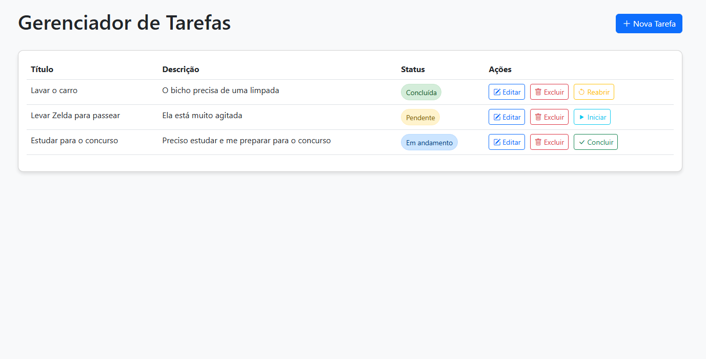

# Sistema de Gerenciamento de Tarefas

Um sistema completo de gerenciamento de tarefas com frontend responsivo e backend RESTful.



## Visão Geral

Este projeto é uma aplicação full-stack para gerenciamento de tarefas que permite aos usuários criar, visualizar, editar e excluir tarefas, além de gerenciar o status de cada tarefa (pendente, em andamento, concluída).

O sistema é dividido em duas partes principais:
- **Frontend**: Interface de usuário responsiva desenvolvida com HTML, CSS, JavaScript e Bootstrap
- **Backend**: API RESTful desenvolvida com Node.js, Express, TypeScript e MySQL

## Funcionalidades Principais

- Listagem de tarefas com status visual
- Criação e edição de tarefas com validação de dados
- Exclusão de tarefas com confirmação
- Alteração de status das tarefas (Pendente → Em andamento → Concluída)
- Design responsivo para dispositivos móveis
- API RESTful com documentação Swagger
- Validação e sanitização de dados
- Banco de dados MySQL para persistência
- Aplicação dockerizada

## Tecnologias Utilizadas

### Frontend
- HTML5, CSS3, JavaScript (ES6+)
- Bootstrap 5 para layout responsivo
- Fetch API para comunicação com o backend

### Backend
- Node.js com Express
- TypeScript para tipagem estática
- MySQL para banco de dados
- Docker e Docker Compose para containerização
- Swagger para documentação da API

## Estrutura do Projeto

```
task-manager/
├── frontend/           # Interface de usuário
│   ├── css/            # Estilos CSS
│   ├── js/             # Scripts JavaScript
│   └── index.html      # Página principal
│
├── backend/            # API RESTful
│   ├── config/         # Configurações de bibliotecas
│   ├── db/             # Configuração do banco de dados
│   ├── src/            # Código-fonte
│   │   ├── controllers/
│   │   ├── middleware/
│   │   ├── repositories/
│   │   ├── routes/
│   │   ├── types/
│   │   ├── validators/
│   │   ├── app.ts
│   │   └── server.ts
│   ├── .env            # Variáveis de ambiente
│   └── docker-compose.yml
│
└── README.md           # Este arquivo
```

## Como Executar

### Backend

1. Navegue até a pasta `backend`
2. Configure as variáveis de ambiente (copie `.env.example` para `.env`)
3. Execute com Docker:
   ```bash
   docker-compose up -d
   ```
   Ou localmente:
   ```bash
   npm install
   npm run dev
   ```
4. A API estará disponível em `http://localhost:9000`
5. A documentação Swagger estará em `http://localhost:9000/api-docs`

6. Execute os testes:
    ```bash
    npm test
    ```

### Frontend

1. Navegue até a pasta `frontend`
2. Abra o arquivo `index.html` em um navegador web
   - Ou use um servidor local como Live Server do VS Code

## Documentação Detalhada

- [Documentação do Frontend](frontend/README.md)
- [Documentação do Backend](backend/README.md)

## Limitações e Regras de Negócio

- Títulos de tarefas são limitados a 100 caracteres
- Descrições de tarefas são limitadas a 500 caracteres
- Uma tarefa deve ter pelo menos um título
- Os status possíveis são: "pendente", "em andamento" e "concluída"

## Contribuição

Para contribuir com este projeto:

1. Faça um fork do repositório
2. Crie uma branch para sua feature (`git checkout -b feature/nova-funcionalidade`)
3. Faça commit das suas alterações (`git commit -m 'Adiciona nova funcionalidade'`)
4. Faça push para a branch (`git push origin feature/nova-funcionalidade`)
5. Abra um Pull Request

## Licença

Este projeto está licenciado sob a licença MIT.