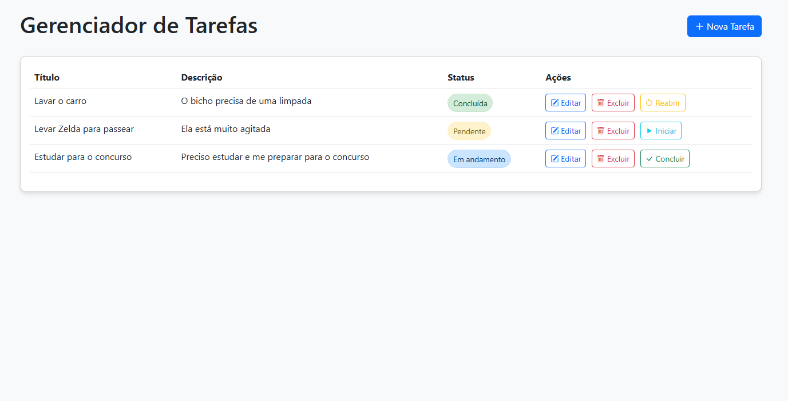

# Frontend do Gerenciador de Tarefas

Interface de usuário para o Gerenciador de Tarefas, desenvolvida com HTML, CSS, JavaScript e Bootstrap.



## Funcionalidades

- Listar tarefas em uma tabela responsiva
- Criar novas tarefas
- Editar tarefas existentes
- Excluir tarefas
- Alterar o status das tarefas (Pendente, Em Andamento, Concluída)
- Notificações de sucesso/erro
- Design responsivo para dispositivos móveis

## Tecnologias Utilizadas

- **HTML5**
- **CSS3**
- **JavaScript (ES6+)**
- **Bootstrap 5**
- **Bootstrap Icons**
- **Fetch API para comunicação com o backend**

## Estrutura de Arquivos

```
frontend/
├── css/
│   └── styles.css       # Estilos personalizados
├── js/
│   ├── api.js           # Módulo para comunicação com a API
│   └── app.js           # Lógica principal da aplicação
└── index.html           # Página principal
```

## Como Executar

1. Certifique-se de que o backend esteja em execução em `http://localhost:9000`
2. Abra o arquivo `index.html` em um navegador web

## Recursos Implementados

### Interface Responsiva
- Layout adaptável para diferentes tamanhos de tela
- Botões com ícones que se adaptam em telas menores

### Gerenciamento de Tarefas
- Formulário para criar e editar tarefas
- Validação de campos obrigatórios
- Confirmação antes de excluir tarefas

### Fluxo de Status
- Botões contextuais para alterar o status das tarefas
- Indicadores visuais para cada status

### Feedback ao Usuário
- Indicador de carregamento
- Notificações toast para ações bem-sucedidas ou erros
- Mensagem quando não há tarefas 